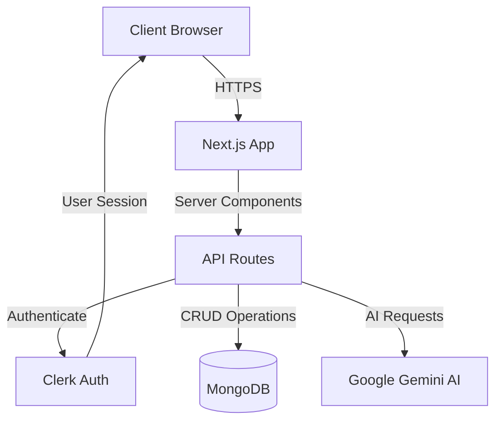
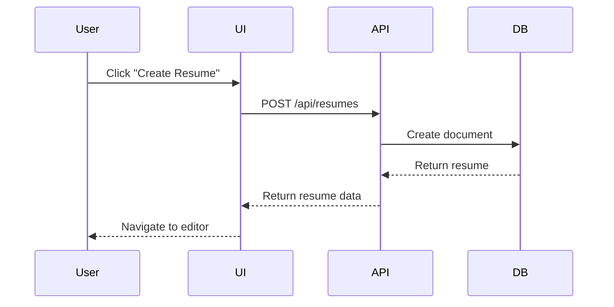
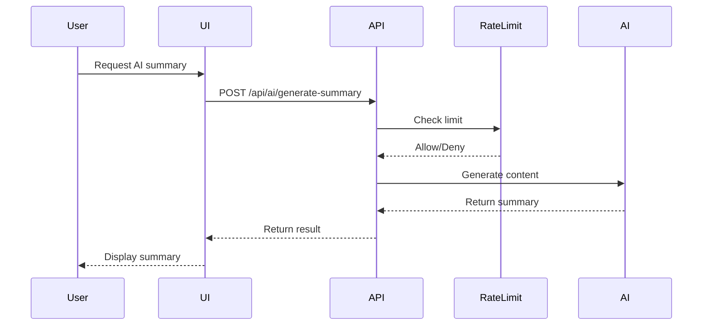

# Architecture Overview

This document provides a comprehensive overview of the AI Resume Builder's architecture, design patterns, and technical decisions.

## System Architecture



## Technology Stack

### Frontend
- **Framework**: Next.js 16 (App Router)
- **UI Library**: React 19
- **Language**: TypeScript
- **Styling**: Tailwind CSS v4
- **Animations**: Framer Motion
- **Rich Text**: TipTap
- **Icons**: Lucide React

### Backend
- **Runtime**: Node.js 20.18.1
- **API**: Next.js API Routes
- **Database**: MongoDB with Mongoose ODM
- **Authentication**: Clerk
- **AI Service**: Google Gemini Flash

### DevOps & Tools
- **Build Tool**: Turbopack (Next.js 16)
- **Package Manager**: npm
- **Linting**: ESLint
- **Type Checking**: TypeScript
- **Version Control**: Git

## Project Structure

```
AI-Resume-Builder/
├── app/                      # Next.js App Router
│   ├── api/                  # API Routes
│   │   ├── ai/              # AI endpoints
│   │   ├── resumes/         # Resume CRUD
│   │   └── webhooks/        # Webhook handlers
│   ├── dashboard/           # Dashboard pages
│   ├── (auth)/              # Auth pages
│   └── layout.tsx           # Root layout
├── components/              # React components
│   ├── ui/                  # Reusable UI components
│   ├── resume/              # Resume-specific components
│   └── dashboard/           # Dashboard components
├── lib/                     # Utility libraries
│   ├── models/              # Mongoose models
│   ├── templates/           # Resume templates
│   ├── validation.ts        # Zod schemas
│   ├── api-error.ts         # Error handling
│   ├── auth-middleware.ts   # Auth helpers
│   └── exportUtils.ts       # PDF/DOCX export
├── hooks/                   # Custom React hooks
├── context/                 # React Context providers
├── public/                  # Static assets
└── docs/                    # Documentation
```

## Core Modules

### 1. Authentication Module

**Technology**: Clerk

**Flow**:
1. User signs in via Clerk
2. Session token stored in cookies
3. Middleware protects routes
4. API routes verify authentication

**Files**:
- `middleware.ts` - Route protection
- `lib/auth-middleware.ts` - API auth helpers

### 2. Resume Management Module

**Responsibilities**:
- CRUD operations for resumes
- Content validation
- Template rendering
- Export functionality

**Key Components**:
- `app/api/resumes/` - API endpoints
- `lib/models/resume.ts` - Data model
- `lib/validation.ts` - Input validation
- `components/resume/` - UI components

### 3. AI Integration Module

**Service**: Google Gemini Flash

**Features**:
- Summary generation
- Bullet point creation
- ATS score analysis
- Cover letter generation
- Skill suggestions

**Implementation**:
- Rate limiting (10 req/min)
- Circuit breaker pattern
- Retry logic with exponential backoff
- Input sanitization

**Files**:
- `app/api/ai/` - AI endpoints
- `lib/retry.ts` - Retry & circuit breaker
- `lib/rate-limit.ts` - Rate limiting
- `lib/sanitize.ts` - Input sanitization

### 4. Export Module

**Formats**: PDF, DOCX

**PDF Export**:
- Uses html2canvas + jsPDF
- Async with progress tracking
- Theme-aware (forces light mode)
- High-quality rendering (2x scale)

**DOCX Export**:
- Uses docx library
- Converts HTML to DOCX
- Preserves formatting

**Files**:
- `lib/exportUtils.ts` - Export utilities
- `lib/htmlToDocx.ts` - HTML conversion

### 5. Template System

**Templates**:
- Modern
- Classic
- Minimal
- Creative

**Architecture**:
- Component-based templates
- Theme color customization
- Responsive design
- Print-optimized

**Files**:
- `lib/templates/` - Template components

## Data Flow

### Resume Creation Flow



### AI Generation Flow



## Design Patterns

### 1. Repository Pattern

Used for database operations:

```typescript
// lib/models/resume.ts
class Resume {
  static findByUserId(userId: string) {
    return this.find({ userId, isDeleted: false });
  }
}
```

### 2. Middleware Pattern

Used for authentication and logging:

```typescript
// lib/auth-middleware.ts
export async function withAuth(handler) {
  return async (req, context) => {
    const { userId } = await auth();
    if (!userId) return unauthorized();
    return handler(req, { userId });
  };
}
```

### 3. Circuit Breaker Pattern

Used for AI service resilience:

```typescript
// lib/retry.ts
class CircuitBreaker {
  async execute(fn) {
    if (this.state === 'OPEN') {
      throw new Error('Circuit breaker is OPEN');
    }
    // Execute with failure tracking
  }
}
```

### 4. Factory Pattern

Used for template creation:

```typescript
// lib/templates/index.ts
export function getTemplate(templateId: string) {
  const templates = {
    modern: ModernTemplate,
    classic: ClassicTemplate,
    // ...
  };
  return templates[templateId];
}
```

## Security Architecture

### Authentication
- Clerk handles auth
- Session-based authentication
- Secure cookie storage
- CSRF protection

### Authorization
- User-based access control
- Resume ownership verification
- API route protection

### Input Validation
- Zod schema validation
- Input sanitization
- XSS prevention
- SQL injection prevention (NoSQL)

### API Security
- Rate limiting
- Request size limits
- CORS configuration
- Security headers

## Performance Optimizations

### Frontend
- Code splitting (Turbopack)
- Dynamic imports for heavy components
- Image optimization
- Bundle size optimization

### Backend
- MongoDB indexing
- Connection pooling
- Caching (in-memory)
- Pagination

### AI Requests
- Rate limiting
- Request queuing
- Circuit breaker
- Retry with backoff

## Scalability Considerations

### Current Architecture
- Monolithic Next.js app
- Single MongoDB instance
- In-memory caching
- In-memory rate limiting

### Future Scalability
- **Horizontal Scaling**: Deploy multiple instances
- **Database**: MongoDB replica set
- **Caching**: Redis for distributed cache
- **Rate Limiting**: Redis-based rate limiting
- **AI Service**: Request queue (Bull/BullMQ)
- **File Storage**: S3 for resume exports

## Error Handling

### Strategy
1. **Validation Errors**: Return 400 with details
2. **Auth Errors**: Return 401/403
3. **Not Found**: Return 404
4. **Server Errors**: Return 500, log details
5. **AI Errors**: Circuit breaker, retry logic

### Logging
- Structured logging with `lib/logger.ts`
- Request ID tracking
- Error context preservation
- Development vs production modes

## Testing Strategy

### Unit Tests
- Utility functions
- Validation schemas
- Business logic

### Integration Tests
- API endpoints
- Database operations
- AI service integration

### E2E Tests
- User flows
- Resume creation
- Export functionality

## Deployment Architecture

### Recommended: Vercel

```
User → Vercel Edge Network → Next.js App
                              ↓
                         MongoDB Atlas
                              ↓
                         Google Gemini API
```

### Environment Variables
- Managed in Vercel dashboard
- Encrypted at rest
- Separate dev/prod configs

## Monitoring & Observability

### Metrics to Track
- API response times
- Error rates
- AI request success rate
- Database query performance
- User session duration

### Recommended Tools
- **Errors**: Sentry
- **Performance**: Vercel Analytics
- **Logs**: Vercel Logs / DataDog
- **Database**: MongoDB Atlas monitoring

## Future Enhancements

### Short Term
1. Redis caching
2. Comprehensive testing
3. Error tracking (Sentry)
4. Performance monitoring

### Long Term
1. Microservices architecture
2. Event-driven system
3. GraphQL API
4. Real-time collaboration
5. Mobile apps

---

**Last Updated**: December 2025  
**Version**: 0.1.0
